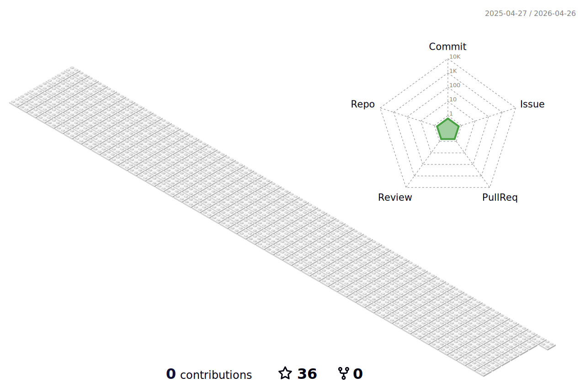

<a href="https://github.com/anuraghazra/github-readme-stats">
  
</a>
</br>
</br>
</br>

- 👋 Hi, I’m @KexunNiu
- 👀 Bachelor of Computing Science at Ualberta EARNED
- 🌱 Currently study in Master of Electrical and Computer Engineering at Western University
- 📫 How to reach me: Email: marika.kniu@gmail.com
  
  [)][1] [)][2]

<!-- To Link your profile to the media buttons -->

[1]: https://www.instagram.com/barryn719_
[2]: https://www.linkedin.com/in/kexun-niu




<!--START_SECTION:waka-->

```txt
From: 14 March 2023 - To: 17 February 2025

Total Time: 271 hrs 39 mins

JavaScript       124 hrs 50 mins >>>>>>>>>>>--------------   45.53 %
Python           70 hrs 34 mins  >>>>>>-------------------   25.74 %
C#               19 hrs 44 mins  >>-----------------------   07.20 %
CSS              14 hrs 19 mins  >------------------------   05.22 %
HTML             13 hrs 47 mins  >------------------------   05.03 %
JSON             6 hrs 15 mins   >------------------------   02.28 %
TypeScript       4 hrs 42 mins   -------------------------   01.72 %
Markdown         4 hrs 30 mins   -------------------------   01.65 %
Other            2 hrs 32 mins   -------------------------   00.93 %
Text             2 hrs 3 mins    -------------------------   00.75 %
```

<!--END_SECTION:waka-->

<a href="https://github.com/anuraghazra/github-readme-stats">
  
</a>

